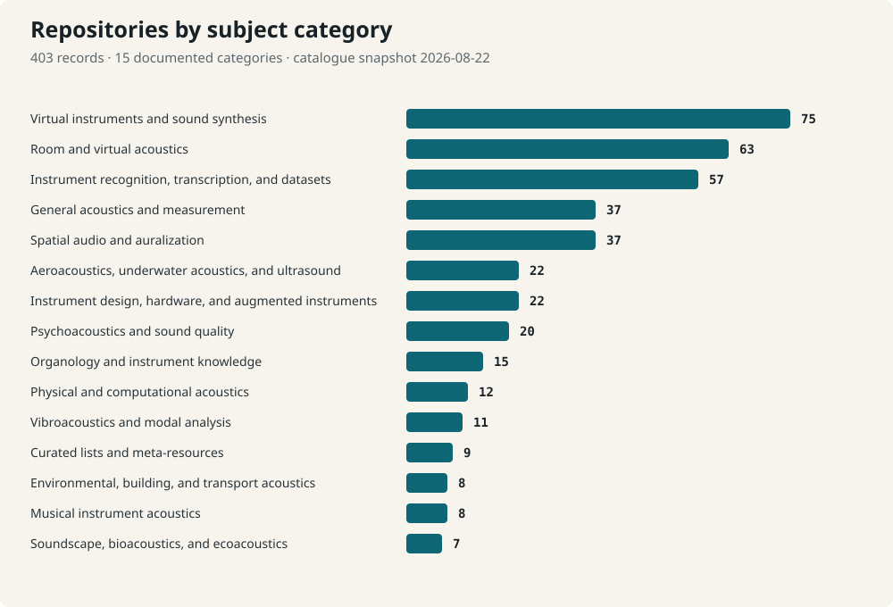

# Audio, Acoustics, and Musical Instruments Repository Index

> Discover, compare, and reuse open-source work across acoustics, audio, musical instruments, organology, synthesis, and spatial sound.

[](https://creativecommons.org/licenses/by/4.0/)
[](LICENSES/MIT.txt)
[](CHANGELOG.md)
[](https://doi.org/10.5281/zenodo.22099291)

**403 repositories · 15 subject categories · 353 core records · OKF 0.2 support · Version 1.0.0**

[Browse by subject](knowledge/index.md) · [Search the database](docs/querying.md) · [Use with an LLM](llms.txt) · [Cite this release](#citation)

This curated and versioned research dataset is part of the PhD thesis project **MODAVIS**. It maps source-code repositories across acoustics, audio, musical instruments, organology, virtual instruments, psychoacoustics, and related research and engineering fields.

> **Use the index as a discovery aid, not as a ranking.** `core` and `adjacent` describe thematic scope only. Inclusion does not imply endorsement, and time-dependent GitHub facts belong to the dated metadata snapshot.



## Start here

| I want to… | Start with |
|---|---|
| Browse repositories by research subject | [`knowledge/index.md`](knowledge/index.md), the progressive OKF 0.2 catalogue |
| Preview the release in a browser | [Rendered catalogue preview](https://modavis-project.github.io/audio-acoustics-instruments-index/ro-crate-preview.html) |
| Search, filter, or count records | [`exports/catalogue.sqlite`](exports/catalogue.sqlite) and the [query guide](docs/querying.md) |
| Analyse the dataset in code or a spreadsheet | [JSONL](data/repositories.jsonl), [JSON](exports/repositories.json), or [CSV](exports/repositories.csv) |
| Give the catalogue to an LLM or agent | [`llms.txt`](llms.txt), then the linked OKF 0.2 knowledge bundle |
| Inspect preservation and research metadata | [RO-Crate 1.3](ro-crate-metadata.json) or the [Frictionless Data Package](datapackage.json) |
| Reuse or cite this release correctly | The [reuse guide](docs/reuse.md), [`CITATION.cff`](CITATION.cff), and the [version DOI](https://doi.org/10.5281/zenodo.22099291) |

## What you can do with it

- find software and datasets within a specific acoustics or instrument-related field;
- compare the distribution of repositories across 15 documented categories;
- assemble a reproducible literature, software, or teaching-resource survey;
- query repository names, descriptions, licences, topics, languages, and dated GitHub metadata;
- provide agents with compact, linked Markdown instead of an undifferentiated data dump;
- cite the exact archived dataset version used in a publication.

A first query takes one command:

```sh
sqlite3 -header -column exports/catalogue.sqlite '
  SELECT full_name, category_label_en
  FROM repository_current
  WHERE scope_status = "core"
    AND primary_category = "musical_instrument_acoustics"
  ORDER BY full_name COLLATE NOCASE
  LIMIT 5;
'
```

Ready-to-run SQL, Python, and `jq` examples are in [`examples/`](examples/); further patterns are documented in [`docs/querying.md`](docs/querying.md).

## Formats

The same catalogue is supplied in complementary representations:

| Resource | Best suited to |
|---|---|
| [`knowledge/index.md`](knowledge/index.md) | Human and LLM browsing through an Open Knowledge Format (OKF) 0.2 hierarchy |
| [Rendered catalogue preview](https://modavis-project.github.io/audio-acoustics-instruments-index/ro-crate-preview.html) | A self-contained visual release preview |
| [`data/repositories.jsonl`](data/repositories.jsonl) | Canonical curated records, one JSON object per line |
| [`exports/repositories.csv`](exports/repositories.csv) | Spreadsheet and tabular analysis |
| [`exports/repositories.json`](exports/repositories.json) | Complete JSON-array processing |
| [`exports/catalogue.sqlite`](exports/catalogue.sqlite) | Relational queries and FTS5 full-text search |
| [`datapackage.json`](datapackage.json) | Frictionless metadata, schema, and interchange |
| [`ro-crate-metadata.json`](ro-crate-metadata.json) | RO-Crate 1.3 research-object metadata |
| [`llms.txt`](llms.txt) | Compact agent-oriented discovery entry point |

The generated knowledge bundle applies **Open Knowledge Format (OKF) 0.2**: category indexes lead to one compact Markdown document per repository. The SQLite database provides normalized categories, aliases, and GitHub metadata plus an FTS5 search table.

## Coverage and scope

Version 1.0.0 contains **403 stable catalogue records**: **353 core records** and **50 adjacent records**, classified into 15 documented subject categories. One historical record is retained as a merged identifier that redirects to its surviving record. The catalogue snapshot is dated **2026-08-22**; public GitHub metadata is verified separately and carries its own capture timestamp.

Included records have a direct or substantively adjacent relationship to one or more of:

- musical instruments, organology, instrument construction, or augmented instruments;
- virtual instruments, synthesis, or physical modelling;
- musical, physical, computational, room, environmental, underwater, or aeroacoustics;
- spatial audio, auralization, psychoacoustics, sound quality, vibration, or acoustic measurement;
- instrument-centred datasets, recognition, transcription, or knowledge resources.

Generic audio infrastructure, generic music generation, notation-only tools, and broad music-information-retrieval projects are outside the core scope unless they have a sufficiently direct instrument or acoustics focus. The exact rules and boundary cases are in [`docs/scope.md`](docs/scope.md) and [`docs/classification-guide.md`](docs/classification-guide.md).

## Data model and responsible reuse

The public repository deliberately separates:

1. **Curated records** in `data/repositories.jsonl`, containing stable catalogue identity, a curator-authored German summary, subject classification, and scope.
2. **Public forge metadata** in `data/github-snapshot.jsonl`, containing time-dependent GitHub facts such as immutable repository ID, current name, description, topics, licence detection, and repository status.
3. **Generated representations** in `exports/` and `knowledge/`.

The canonical JSONL is authoritative. Generated artifacts must be rebuilt with `make build`; automated validation rejects inconsistent outputs. Field semantics are documented in [`docs/data-dictionary.md`](docs/data-dictionary.md), the schemas are in [`schema/`](schema/), and representation decisions are recorded in [`docs/architecture.md`](docs/architecture.md).

When reusing the catalogue, retain `catalogue_id`, cite the version DOI, state any filtering decisions, and distinguish curated classifications from dated forge metadata. Listed repositories retain their own licences. See [`docs/reuse.md`](docs/reuse.md) for a concise checklist.

## Reproduce and validate

Install [uv](https://docs.astral.sh/uv/) and use the checked-in lock file and Python version. This keeps the generated SQLite file byte-identical across release builds.

```sh
uv sync --frozen --extra validation
make build
make validate
make release-check
```

The scripts support Python 3.11 or newer. For an exploratory build without uv, use `make PYTHON=python3 build`; its SQLite file may differ at the byte level when linked against another SQLite release while containing the same logical data.

Refreshing public GitHub metadata requires an authenticated GitHub CLI:

```sh
make refresh
make build validate
```

The refresh process never changes curated descriptions, categories, scope decisions, or catalogue identifiers automatically.

## Citation

Use the version-specific Zenodo DOI and the metadata in [`CITATION.cff`](CITATION.cff):

> Ukolov, Dominik. *Audio, Acoustics, and Musical Instruments Repository Index*. Version 1.0.0. MODAVIS PhD thesis project. Dataset. [https://doi.org/10.5281/zenodo.22099291](https://doi.org/10.5281/zenodo.22099291)

For reproducibility, cite the exact version used rather than the default branch. Catalogue identifiers such as `GHIAO-0001` remain stable across releases.

## Contribute

The catalogue becomes more useful when omissions and boundary cases are visible. You can [suggest a repository](https://github.com/modavis-project/audio-acoustics-instruments-index/issues/new?template=new-repository.yml), [report a correction](https://github.com/modavis-project/audio-acoustics-instruments-index/issues/new?template=correction.yml), or propose a classification change. Please read [`CONTRIBUTING.md`](CONTRIBUTING.md) first; curated fields always receive human review.

## Licence

The curated dataset, taxonomy, generated knowledge documents, and documentation are licensed under [CC BY 4.0](https://creativecommons.org/licenses/by/4.0/). Build and validation code is licensed under the [MIT License](LICENSES/MIT.txt). These licences cover this catalogue's selection, arrangement, and original content; they do not relicense the listed repositories or their contents. See [`LICENSE`](LICENSE) for details.
